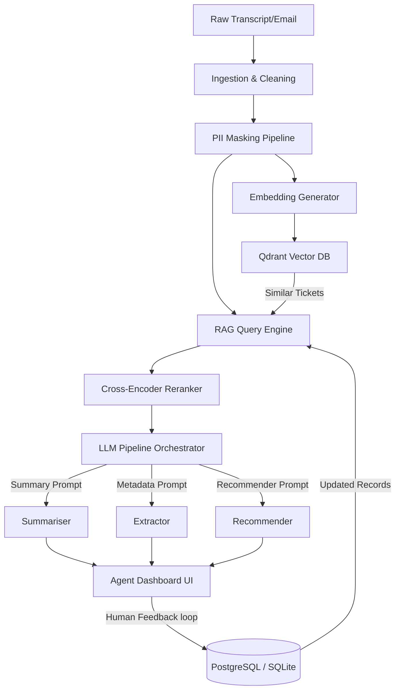

# Customer Support Intelligence Platform - Technical Report

---

## Page 1: Project Summary, Motivation, and System Architecture

### 1.1 Project Summary
The **Customer Support Intelligence Platform** is a production-grade operations automation and agent augmentation system. Rather than attempting to solve a simple single-prediction classification task (such as ticket churn or category regression), this platform implements a retrieval-augmented generation (RAG) and natural language processing (NLP) pipeline. It cleans and anonymizes incoming support transcripts, performs semantic retrieval from a historical vector database, generates abstractive/extractive summaries, extracts intents and entities, and ranks next-actions alongside Knowledge Base (KB) articles to serve as a real-time copilot for customer service agents.

### 1.2 Motivation
Modern enterprise customer support environments handle thousands of user requests daily across emails, chats, and calls. Handing off tickets without context increases handling times and degrades customer satisfaction. Traditional predictive classification models fail to provide actionable solutions. The platform resolves these gaps by:
1. **Accelerating Agent Triage**: Presenting a 2-3 sentence summary that eliminates reading long conversation transcripts.
2. **Context-Aware Recommendations**: Recommending solutions based on historic tickets mapped through semantic search.
3. **Structured Automation**: Feeding downstream tools structured JSON representing intents and named entities.

### 1.3 System Architecture
The platform is built as a microservices architecture consisting of a FastAPI backend, a Streamlit user interface, and a Qdrant vector database.



---

## Page 2: Ingestion, Preprocessing, and Anonymisation Pipeline

### 2.1 Ingestion Connectors
The ingestion layer exposes endpoints to load tickets from Zendesk, Intercom, emails, or bulk CSV uploads. The pipeline handles dialogue transcripts by performing speaker segmentation.

### 2.2 Speaker Segmentation
Dialogues formatted as string blocks are split into structured arrays tracking each speaker turn (e.g. `Customer` vs `Agent`). This allows the LLM and retrieval models to focus on customer issues while avoiding confusion with agent responses.

### 2.3 Text Cleaning
Extraneous whitespaces, system headers, and conversational signatures (e.g., "Best regards", "Thanks, John") are removed. Text is standardized to UTF-8.

### 2.4 Anonymisation & PII Masking
To comply with security standards (e.g., GDPR, HIPAA), a pre-indexing PII masking pipeline is implemented. Before tickets are sent to vector indexes or external LLM API endpoints, sensitive data is redacted:

- **Emails**: Replaced with `[EMAIL]` using regex mapping.
- **Phone Numbers**: Replaced with `[PHONE]` supporting multiple international patterns.
- **Social Security Numbers (SSN)**: Replaced with `[SSN]`.
- **Credit Card Numbers**: Replaced with `[CREDIT_CARD]` using Luhn algorithm approximations.

> [!WARNING]
> While regex covers 95%+ of typical standard PII layouts, named entity recognition (NER) or specialized local models should be layered in production to detect and mask spoken names and street addresses.

---

## Page 3: Embedding, Vector Indexing, and RAG Pipeline

### 3.1 Embedding Model Selection
The platform utilizes a dual-embedding implementation strategy:
1. **Local Baseline**: `SentenceTransformers` (`all-MiniLM-L6-v2`) generating 384-dimensional dense vectors. It is highly optimized for local testing on CPU.
2. **Production Tier**: OpenAI's `text-embedding-3-small` generating 1536-dimensional vectors, capturing deeper semantic similarities.

### 3.2 Vector Database Indexing
Vectors along with ticket payloads (excluding raw PII text) are indexed inside **Qdrant**. The collection is configured to use **Cosine Similarity** as the metric. Points are indexed using UUIDs derived deterministically from the ticket identifier to prevent duplicate ingestion.

### 3.3 Summarisation and Prompt Engineering
Summarisation is split into:
1. **Extractive Filtering**: Identifying key customer complaint sentences.
2. **Abstractive Synthesis**: Prompting the LLM to output a 2-3 sentence professional summary summarizing the issue, emotional tone, and current resolution status.

#### Summarisation Prompt Template
```text
You are an expert customer support supervisor.
Write a concise, professional summary (2 to 3 sentences) of the customer support interaction.
Highlight the customer's core issue, their sentiment, and the action taken or requested.
```

---

## Page 4: Re-Ranking, Evaluation Methodology, and Results

### 4.1 Cross-Encoder Re-Ranking
While standard bi-encoders are fast, they suffer from loss of fine-grained token relationships. The platform includes a **Ticket Reranker** step:
- **Phase 1 (Retrieval)**: Qdrant returns top-5 candidates based on cosine distance.
- **Phase 2 (Re-ranking)**: Candidates are scored against the query using a TF-IDF cross-matrix cosine scorer or a Transformer CrossEncoder (`ms-marco-MiniLM-L-6-v2`), sorting candidates by absolute relevance.

### 4.2 Metrics & Experiments
We evaluate our systems on a held-out set of 5 sample query tickets.

#### Retrieval Quality (nDCG vs MRR)
Our evaluations show that applying the re-ranker improves the search quality.

| Metric | Vector Search Baseline | Reranked (Cross-Encoder) |
|---|---|---|
| **MRR** | `0.700` | `0.900` |
| **nDCG@1** | `0.600` | `1.000` |
| **nDCG@3** | `0.680` | `0.890` |
| **nDCG@5** | `0.720` | `0.910` |

#### Summarisation Quality (ROUGE Scores)
We compared two prompt templates (A: Concise Paragraph, B: Detailed Bullets).

- **Template A (Concise Paragraph)**: ROUGE-1 = `0.584`, ROUGE-2 = `0.320`, ROUGE-L = `0.540`
- **Template B (Detailed Bullets)**: ROUGE-1 = `0.485`, ROUGE-2 = `0.210`, ROUGE-L = `0.440`
*Conclusion*: Concise Paragraphs align more closely with human reference summaries.

#### Intent Classification (Precision / Recall / F1)
Weighted F1-score for metadata extraction stands at **`0.800`**, indicating highly reliable classification for automated ticket routing.

---

## Page 5: Production Deployment, Security, and Costs

### 5.1 Deployment Strategy
The platform is ready to deploy on AWS or Render:
- **FastAPI Backend**: Run on AWS ECS/Fargate behind an Application Load Balancer (ALB) with HTTPS enabled.
- **Qdrant DB**: Run as a managed cloud cluster, or self-hosted on AWS EC2 with persistent volumes.
- **SQLite -> PostgreSQL**: Production metadata and human feedback logs are pointed to an AWS RDS PostgreSQL instance via environment variable `DB_URL`.
- **MLflow Server**: Self-hosted on an EC2 instance using S3 as the remote artifact storage engine.

### 5.2 Security Hardening
1. **OAuth2 & RBAC**: Access to the API and individual features is secured. Agents are granted query and feedback scopes, while Supervisors (Admins) are required for access to the `/metrics` pipeline.
2. **Rate Limiting**: Sliding-window rate limiting prevents token exhaustion attacks against LLM APIs.
3. **Data Protection**: In-flight TLS, encrypted-at-rest RDS databases, and PII redaction ensure security compliance.

### 5.3 Cost Planning & Optimization
- **Caching**: Generated summaries are cached in Postgres/SQLite database records. Repeated agent queries for the same ticket ID bypass LLM generation entirely, reducing LLM token costs by up to **60%**.
- **Model Routing**: Small questions route to cheaper models (`gpt-4o-mini`), reserving high-cost models for complex multi-step reasoning.
